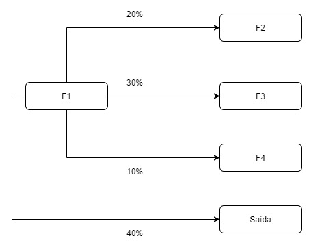

# Simulação de Metodos Analíticos: Trabalho 1
<p align="justify">

Nesta entrega o programa espera alguns argumentos de entrada: quantidade de números aleatórios a serem produzidos na simulação (**N**), semente a ser utilizada pelo gerador de números (**S**) e arquivo de entrada com o tempo de primeira chegada, descrição das filas e suas características e as conexões existentes entre elas com as probabilidades de passagem entre cada uma (**A**).

Portanto, para executar o programa:
> javac *.java

> java Simulator N S A

O arquivo de entrada segue o seguinte formato:

Primeiramente a descrição da primeira chegada em uma das filas;
depois uma sequência de informações, em cada linha, das filas a serem criadas:
1. Nome
2. Quantia de servidores
3. Capacidade
4. Tempo mínimo de chegada
5. Tempo máximo de chegada
6. Tempo mínimo de atendimento
7. Tempo máximo de atendimento

Então segue-se uma linha em branco e após isso, nas linhas subsequentes, a descrição das conecções entre as filas, no formato: "origem:destino:probabilidade".

Segue exemplo de arquivo de entrada com duas filas em tandem:

```
firstArrival:F1:3.0
queue:F1
servers:3
capacity:8
minArrival:2
maxArrival:4
minService:3
maxService:5
queue:F2
servers:1
capacity:5
minArrival:2
maxArrival:4
minService:3
maxService:5

F1:F2:1.0
F2:exit:1.0
```

Note que, caso existam múltiplas conexões saindo de uma mesma origem, digamos que da fila F1, então as probabilidades deveriam pela lógica correta somarem todas ao total de 100%. Porém o programa não verifica isto e fica como responsabilidade de quem monta o arquivo o fazê-lo desta forma.


</p>